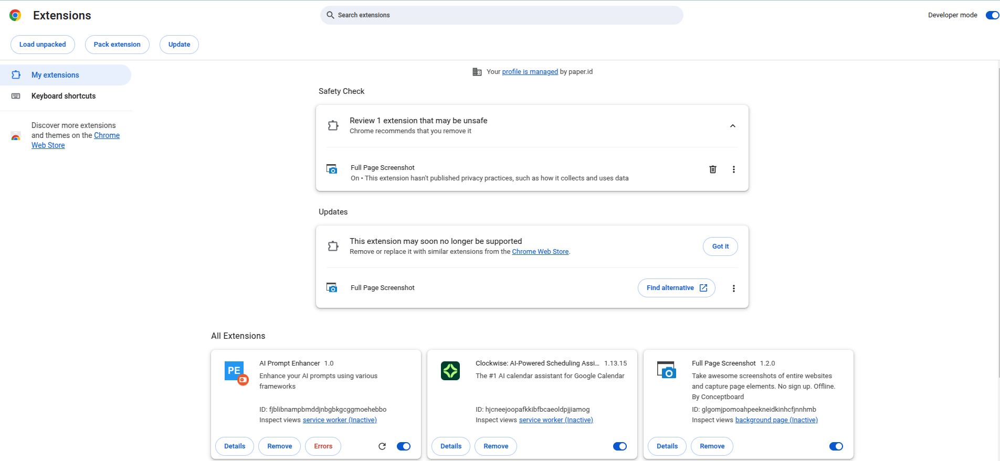
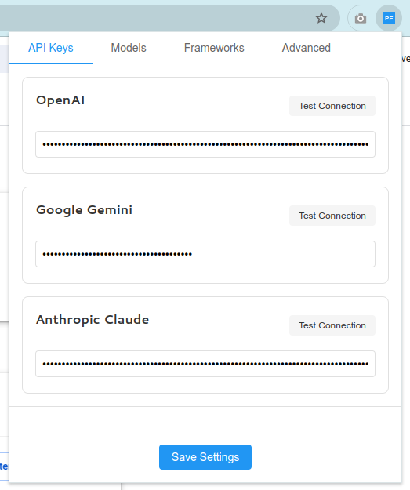
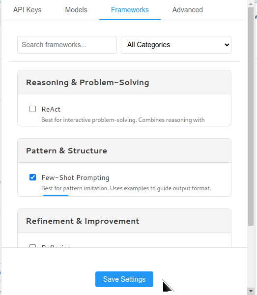
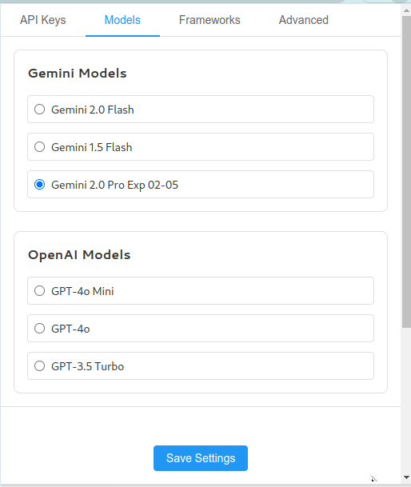
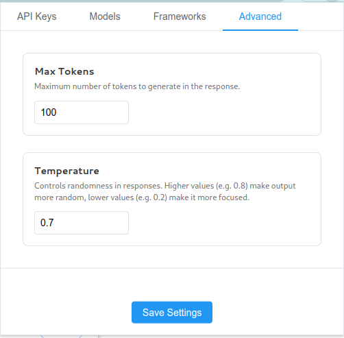
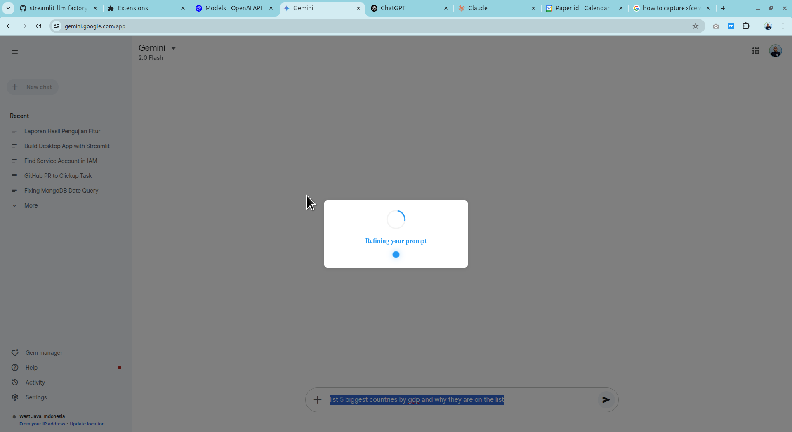
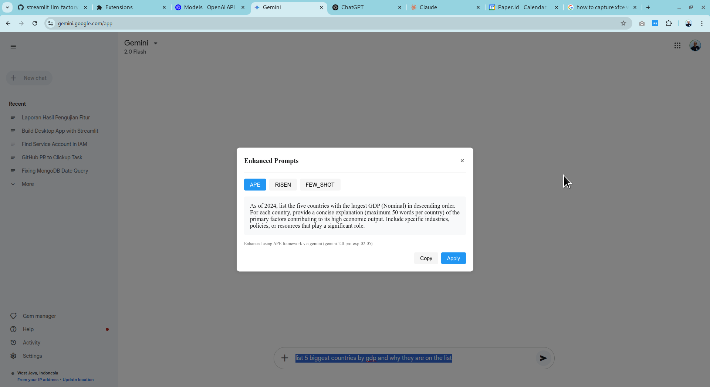

# AI Prompt Enhancer Chrome Extension

A Chrome extension that helps enhance your AI prompts using various frameworks like Chain-of-Thought (CoT), RISEN, and APE. The extension works with popular AI platforms like ChatGPT, Google Gemini, and Anthropic Claude.

## Features

- Enhance prompts using multiple frameworks:
  - Chain-of-Thought (CoT) - Best for analytical tasks
  - RISEN Framework - Best for structured outputs
  - APE Framework - Best for iterative refinement
- Support for latest AI models:
  - OpenAI: GPT-4o, GPT-4o Mini, GPT-3.5 Turbo
  - Google Gemini: Gemini 2.0 Flash, Gemini 1.5 Flash, Gemini 2.0 Pro
  - Anthropic Claude: Claude 3.7 Sonnet, Claude 3.5 Haiku, Claude 3.5 Sonnet
- Right-click context menu integration
- Easy-to-use popup interface
- Secure API key storage
- Copy or directly apply enhanced prompts
- Works on any website with text input fields

## Screenshots


Overview of the extension's popup interface showing the main enhancement options.

### Configuration



Secure API key configuration for different AI providers.



Select and customize enhancement frameworks based on your needs.



Choose preferred AI models for each provider.

### Advanced Features



Fine-tune the enhancement process with advanced settings.

### Usage Examples

**Note**: _To use the extension, you need to set up your API keys and select the desired frameworks and models, selecting the text you want to enhance and right clicking the `Enhance Prompt` button._



Examples of prompt enhancement in action, showing before and after results.

## Installation

1. Clone this repository:
```bash
git clone https://github.com/ridwanpaper/prompt-enhancer.git
cd prompt-enhancer
```

2. Install dependencies and generate icons:
```bash
npm install
npm run generate-icons
```

3. Load the extension in Chrome:
   - Open Chrome and go to `chrome://extensions/`
   - Enable "Developer mode" in the top right
   - Click "Load unpacked" and select the `prompt-enhancer` directory

## Getting API Keys

### OpenAI API Key
1. Visit [OpenAI's platform](https://platform.openai.com/)
2. Sign up or log in to your account
3. Go to the [API keys section](https://platform.openai.com/api-keys)
4. Click "Create new secret key"
5. Copy the generated API key (Note: it will only be shown once)

### Google Gemini API Key
1. Visit the [Google AI Studio](https://aistudio.google.com/apikey)
2. Sign in with your Google account
3. Click "Create API Key"
4. Copy the generated API key
5. Note: If you haven't used Google Cloud before, you may need to set up billing (free tier available)

### Anthropic Claude API Key
1. Visit [Anthropic's Console](https://console.anthropic.com/)
2. Sign up or log in to your account
3. Go to the [API Keys section](https://console.anthropic.com/settings/keys)
4. Click "Create Key"
5. Copy the generated API key

## Configuration

1. Click the extension icon in Chrome's toolbar
2. Enter your API keys in the settings section:
   - Each API key will be securely stored in Chrome's storage system
   - You can use any combination of services - only configure the ones you plan to use
3. Select your preferred frameworks:
   - Choose up to 3 frameworks for prompt enhancement
   - Each framework is optimized for different types of tasks
4. Optional: Configure default models for each provider
   - OpenAI: Choose between GPT-4o, GPT-4o Mini, or GPT-3.5 Turbo
   - Gemini: Select from Gemini 2.0 Flash, 1.5 Flash, or 2.0 Pro
   - Claude: Pick from Claude 3.7 Sonnet, 3.5 Haiku, or 3.5 Sonnet

## Usage

1. Select text in any input field on any website
2. Access the enhancer in two ways:
   - Right-click and select "Enhance Prompt" from the context menu
   - Use the extension's popup interface by clicking its icon
3. Choose from the available enhancement frameworks
4. Review the enhanced versions of your prompt
5. Either:
   - Click "Apply" to automatically replace the selected text
   - Click "Copy" to copy the enhanced prompt to your clipboard

## Privacy & Security

- API keys are stored securely in Chrome's storage system
- No data is collected or transmitted except to the specified AI services
- All prompt enhancement is done through official APIs
- The extension requires minimal permissions:
  - `storage`: For saving your settings
  - `activeTab`: For interacting with the current webpage
  - `contextMenus`: For the right-click menu
  - `scripting`: For applying enhanced prompts

## Development

The extension is built using:
- Chrome Extension Manifest V3
- Vanilla JavaScript
- Chrome Storage API for settings
- Context Menus API for right-click integration

To modify the extension:
1. Make your changes to the source files
2. Reload the extension in Chrome's extensions page
3. Test the changes

For debugging:
- Use Chrome's developer tools
- Check the "background page" in chrome://extensions
- Monitor the console for any errors

## Contributing

1. Fork the repository
2. Create a feature branch
3. Make your changes
4. Submit a pull request

Please ensure your changes:
- Follow the existing code style
- Include appropriate documentation
- Don't introduce new dependencies without discussion
- Pass all existing tests

## License

MIT License - feel free to use and modify as needed.